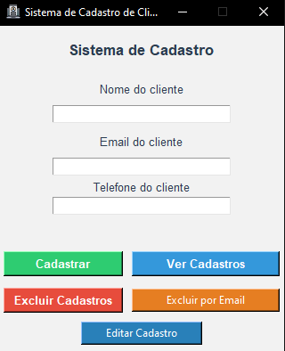

# 💻 Portfólio | Desenvolvedor Python

Olá! 👋 Seja bem-vindo ao meu portfólio.

Sou um desenvolvedor em **Python**, com foco em aplicações desktop utilizando **Tkinter**.  
Gosto de criar sistemas simples, organizados e funcionais, sempre buscando evoluir e aprender mais como programador.

---

## 🚀 Sobre mim

- Forte interesse em tecnologia e programação  
- Foco atual em **Python**  
- Desenvolvimento de aplicações com **interface gráfica (GUI)**  
- Código organizado, com validação de dados e boa experiência para o usuário  

---

## 📂 Projetos

### 📌 Calculadora Desktop (Tkinter)

🧮 Aplicação de calculadora desenvolvida em Python com interface gráfica.

  

**Funcionalidades:**
- Operações básicas: soma, subtração, multiplicação e divisão
- Suporte a números decimais
- Tratamento de divisão por zero
- Interface simples e intuitiva
- Visor protegido contra edição manual

**Tecnologias utilizadas:**
- Python
- Tkinter
- Lógica de programação

📁 **Pasta do projeto:** `calculadora-tkinter/`

---

### 📌 Sistema de Cadastro de Clientes

🖥️ Aplicação desktop desenvolvida em Python com interface gráfica para gerenciamento de clientes.

### 🖼️ Interface do Sistema

**Funcionalidades:**
- Cadastro de clientes (nome, email e telefone)
- Validação de dados
- Listagem de cadastros
- Edição de registros
- Exclusão individual por email
- Exclusão total de cadastros
- Salvamento dos dados em arquivo `.txt`

**Tecnologias utilizadas:**
- Python
- Tkinter
- Manipulação de arquivos

📁 **Pasta do projeto:** `sistema-de-cadastros/`

---

## 🛠️ Tecnologias

- Python  
- Tkinter  
- Lógica de programação  
- Interface gráfica (GUI)  
- Manipulação de arquivos  

---

## 📞 Contato

📧 **Email:** josegabrieldealmeidalima2505@gmail.com  
📱 **WhatsApp:** (81) 99349-5993  

---

## 📌 Observação

Este portfólio está em constante evolução.  
Novos projetos serão adicionados conforme meu aprendizado avança.

💡 Aberto a pequenos projetos, sistemas personalizados e oportunidades de aprendizado.

Obrigado por visitar! 😄🚀
